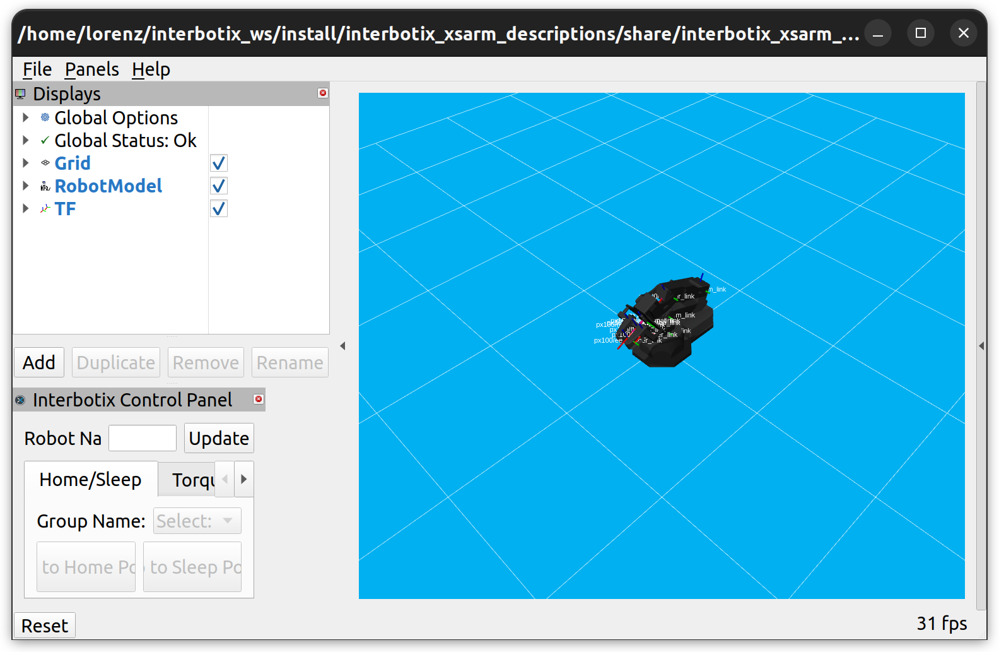
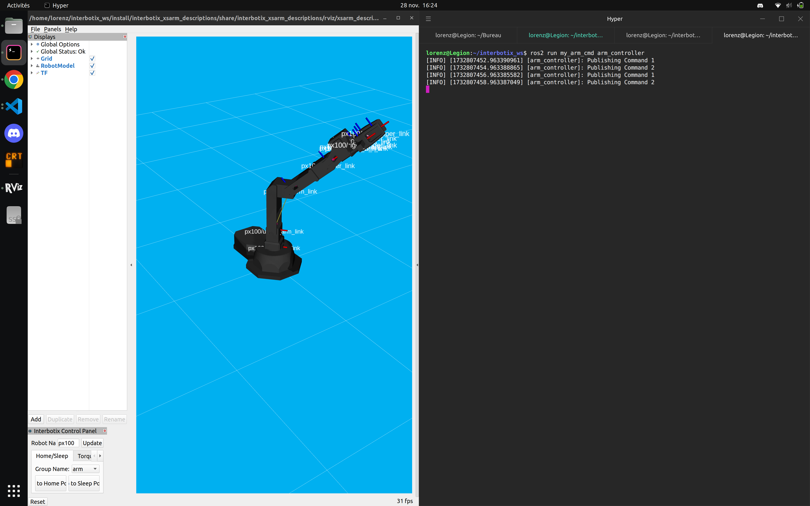

**Cazaubon Lorenz ROB4**

**Desue Léo ROB4**

# Lab 3 Report: Intro to ROS 2 and Robotic Arm Control

## Overview

This lab introduces the **Interbotix PX100 robotic arm** and its corresponding **ROS 2 packages**. The objectives include testing the software tools, understanding joint position definitions, and programming controls to manipulate the arm and gripper.

All screenshots were taken on a sim env just after the lab session. With these commands : 

```bash
ros2 launch interbotix_xsarm_control xsarm_control.launch.py robot_model:=px100 use_sim:=true
```

---

## 1. Test the Interbotix Software

### Steps Performed:

1. Unfortunately we ran into some issues launching the interbotix package on the provided computer. Thus we installed all the packages and necessary dependencies on one of our laptop.

2. After some troubleshooting, we were able to run the `interbotix_xsarm_control` with the following command but not the `moveit_interface`.

    ```bash
    ros2 launch interbotix_xsarm_control xsarm_control.launch.py robot_model:=px100
    ```
    

    We weren't able to try out the planning feature but this wasn't an issue for the following part of the lab.

---

## 2. Control the Arm with a ROS Node

### 2.1 Gripper Setup
- Modified the `modes.yaml` file to enable **PWM mode** for the gripper:
  ```yaml
  gripper:
    operating_mode: pwm
  ```

### 2.2 Understanding Joint Positions
1. Started the arm controller node:
   ```bash
   ros2 launch interbotix_xsarm_ros_control xsarm_ros_control.launch.py robot_model:=px100 dof:=4
   ```
2. Disabled torque on the servomotors:
   ```bash
   ros2 service call /px100/torque_enable interbotix_xs_msgs/srv/TorqueEnable "{cmd_type: 'group', name: 'all', enable: false}"
   ```
3. Used the `ros2 topic echo` command to monitor joint positions:
   ```bash
   ros2 topic echo /px100/joint_states
   ```
   - Noted joint values for **waist**, **shoulder**, **elbow**, and **wrist**.
   - Moved the manipulator to another position and recorded updated joint positions.

### 2.3 Programming the Controls
1. **Package Creation**:
   - Created a package named `my_arm_cmd` with the appropriate `CMakeLists.txt` file.
        ```cpp
        cmake_minimum_required(VERSION 3.8)
        project(my_arm_cmd)

        if(CMAKE_COMPILER_IS_GNUCXX OR CMAKE_CXX_COMPILER_ID MATCHES "Clang")
        add_compile_options(-Wall -Wextra -Wpedantic)
        endif()

        # find dependencies
        find_package(ament_cmake REQUIRED)
        find_package(rclcpp REQUIRED)
        find_package(std_msgs REQUIRED)
        find_package(interbotix_xs_msgs REQUIRED)

        add_executable(arm_controller src/arm_controller.cpp)
        ament_target_dependencies(arm_controller rclcpp interbotix_xs_msgs)
        install(TARGETS arm_controller DESTINATION lib/${PROJECT_NAME})

        if(BUILD_TESTING)
        find_package(ament_lint_auto REQUIRED)
        # the following line skips the linter which checks for copyrights
        # comment the line when a copyright and license is added to all source files
        set(ament_cmake_copyright_FOUND TRUE)
        # the following line skips cpplint (only works in a git repo)
        # comment the line when this package is in a git repo and when
        # a copyright and license is added to all source files
        set(ament_cmake_cpplint_FOUND TRUE)
        ament_lint_auto_find_test_dependencies()
        endif()

        ament_package()
        ```

2. **Steps**:
   - Identified the message type in `/interbotix_ros_core/interbotix_ros_xseries/interbotix_xs_msgs/`.
   - Wrote our arm_controller node :
        ```cpp
        #include "rclcpp/rclcpp.hpp"
        #include "interbotix_xs_msgs/msg/joint_group_command.hpp"
        #include <chrono>
        #include <vector>

        using namespace std::chrono_literals;

        class ArmController : public rclcpp::Node {
        public:
            ArmController() : Node("arm_controller") {
                // Publisher to the /px100/commands/joint_group topic
                publisher_ = this->create_publisher<interbotix_xs_msgs::msg::JointGroupCommand>(
                    "/px100/commands/joint_group", 10);

                // Timer to send commands
                timer_ = this->create_wall_timer(
                    2s, std::bind(&ArmController::publish_joint_commands, this));

                // Initialize joint positions
                command1_.name = "arm";
                command1_.cmd = {0.0, 0.0, 0.0, 0.0}; // First Position

                command2_.name = "arm";
                command2_.cmd = {1.0, 0.0, -1.0, 0.0}; // Second Position

                // Start with the first command
                use_command1_ = true;
            }

        private:
            void publish_joint_commands() {
                if (use_command1_) {
                    RCLCPP_INFO(this->get_logger(), "Publishing Command 1");
                    publisher_->publish(command1_);
                } else {
                    RCLCPP_INFO(this->get_logger(), "Publishing Command 2");
                    publisher_->publish(command2_);
                }
                use_command1_ = !use_command1_; // Toggle between commands
            }

            rclcpp::Publisher<interbotix_xs_msgs::msg::JointGroupCommand>::SharedPtr publisher_;
            rclcpp::TimerBase::SharedPtr timer_;
            interbotix_xs_msgs::msg::JointGroupCommand command1_;
            interbotix_xs_msgs::msg::JointGroupCommand command2_;
            bool use_command1_;
        };

        int main(int argc, char **argv) {
            rclcpp::init(argc, argv);
            rclcpp::spin(std::make_shared<ArmController>());
            rclcpp::shutdown();
            return 0;
        }
        ```
    - We then tested our node by running this command :
  
        ```bash
            ros2 run my_arm_cmd arm_controller
        ```
    

### 2.4 Control the Gripper to Pick Up an Object
1. Controlled the gripper using the topic `/px100/commands/joint_single`:
   - Adjusted PWM values:
     - `my_msg.cmd = -300.0`: Closes the gripper.
     - `my_msg.cmd = +300.0`: Opens the gripper.
  
2. We didn't have enough time to grab and move an object in real life but according to the sim, the code would work if an object was placed at the first postion.

    ```cpp
    #include "rclcpp/rclcpp.hpp"
    #include "interbotix_xs_msgs/msg/joint_group_command.hpp"
    #include "interbotix_xs_msgs/msg/joint_single_command.hpp"
    #include <chrono>
    #include <vector>

    using namespace std::chrono_literals;

    class ArmController : public rclcpp::Node {
    public:
        ArmController() : Node("arm_controller") {
            // Publisher to the /px100/commands/joint_group topic
            arm_publisher_ = this->create_publisher<interbotix_xs_msgs::msg::JointGroupCommand>(
                "/px100/commands/joint_group", 10);

            // Publisher to the /px100/commands/joint_single topic for the gripper
            gripper_publisher_ = this->create_publisher<interbotix_xs_msgs::msg::JointSingleCommand>(
                "/px100/commands/joint_single", 10);

            // Timer to send commands
            timer_ = this->create_wall_timer(
                3s, std::bind(&ArmController::publish_commands, this));

            // Initialize joint positions
            command1_.name = "arm";
            command1_.cmd = {0.0, 0.0, 0.0, 0.0}; // First Position

            command2_.name = "arm";
            command2_.cmd = {1.0, 0.0, -1.0, 0.0}; // Second Position

            // Initialize gripper commands
            gripper_close_.name = "gripper";
            gripper_close_.cmd = -300.0; // Close the gripper

            gripper_open_.name = "gripper";
            gripper_open_.cmd = 300.0; // Open the gripper

            // Start with the first command
            use_command1_ = true;
        }

    private:
        void publish_commands() {
            if (use_command1_) {
                RCLCPP_INFO(this->get_logger(), "Publishing Command 1 and Closing Gripper");
                arm_publisher_->publish(command1_);
                gripper_publisher_->publish(gripper_close_);
            } else {
                RCLCPP_INFO(this->get_logger(), "Publishing Command 2 and Opening Gripper");
                arm_publisher_->publish(command2_);
                gripper_publisher_->publish(gripper_open_);
            }
            use_command1_ = !use_command1_; // Toggle between commands
        }

        rclcpp::Publisher<interbotix_xs_msgs::msg::JointGroupCommand>::SharedPtr arm_publisher_;
        rclcpp::Publisher<interbotix_xs_msgs::msg::JointSingleCommand>::SharedPtr gripper_publisher_;
        rclcpp::TimerBase::SharedPtr timer_;
        interbotix_xs_msgs::msg::JointGroupCommand command1_;
        interbotix_xs_msgs::msg::JointGroupCommand command2_;
        interbotix_xs_msgs::msg::JointSingleCommand gripper_close_;
        interbotix_xs_msgs::msg::JointSingleCommand gripper_open_;
        bool use_command1_;
    };

    int main(int argc, char **argv) {
        rclcpp::init(argc, argv);
        rclcpp::spin(std::make_shared<ArmController>());
        rclcpp::shutdown();
        return 0;
    }
    ```

---


